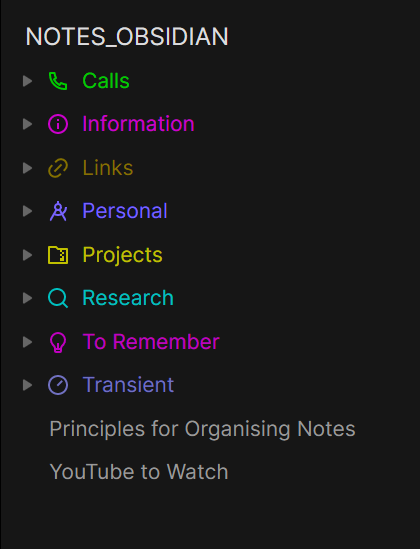
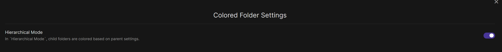

# Obsidian Colored Folder

This is a plugin for Obsidian (https://obsidian.md) that provides colorization of folders and items in the Obsidian sidebar. 

## Using the plugin

- Right-click on a folder or item in the sidebar and select `Change Color`. 
- In the dialog box type in a HEX code e.g. `#FF0000`.
- Click `Insert` to close the dialog box. 

## Settings

The plugin currently has a setting that allows you to change the behaviour of the colorization. When hierarchical mode is on, a folder's child items are have the same color as their parent. When hierarchical mode is off, a folder's child items have the default color.

### Hierarchical Mode - On

### Hierarchical Mode - Off

You can toggle hierarchical mode by going to the `Color Folder` settings tab in the Obisidian Options palette. 

## Repo

See https://github.com/maptz/obsidian-colored-folder
